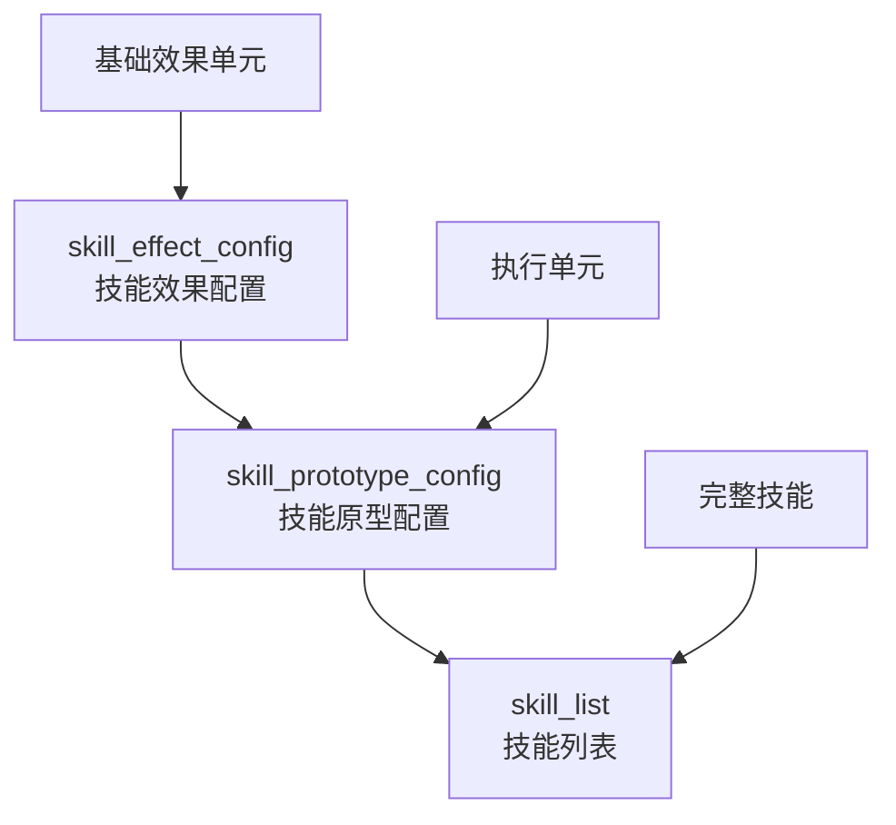

# 技能系统

这是一个基于三层架构设计的游戏技能系统，玩家和 NPC 的所有技能都通过数据表进行配置。

!!! info "数据表示说明"

    - `<>` 表示数据表
    - `{}` 表示数值或参数
    - `[]` 表示字段

## 系统架构

技能系统采用**效果 → 原型 → 技能**的三层架构：



### 层次说明

- **技能效果配置** - 最基础的效果单元，定义单一的效果类型（如伤害、治疗、属性调整等）
- **技能原型配置** - 技能的执行单元，定义具体的效果行为和目标选择
- **技能列表** - 完整的可使用技能，包含技能的基本信息

### 配置流程

1. **配置技能效果** → 在 `skill_effect_config` 中定义基础效果类型和参数
2. **配置技能原型** → 在 `skill_prototype_config` 中调用效果配置，设定目标和执行逻辑
3. **组合完整技能** → 在 `skill_list` 中将多个原型组合成可使用的技能

---

## 数据结构

### 效果配置表 (skill_effect_config)

这是技能系统的基础层，定义所有可能的技能效果。

| 字段名           | 类型   | 说明                           |
| ---------------- | ------ | ------------------------------ |
| `skil_effect_id` | INT    | 技能效果 ID，用于识别和索引    |
| `skil_effect`    | ENUM   | 效果类型枚举，定义具体的效果   |
| `skil_param_a`   | STRING | 效果参数 A，根据效果类型而调用 |
| `skil_param_b`   | STRING | 效果参数 B，根据效果类型而调用 |
| `skil_param_c`   | STRING | 效果参数 C，根据效果类型而调用 |
| `skil_param_d`   | STRING | 效果参数 D，根据效果类型而调用 |

!!! note "字段说明"

    - `skil_effect` - 效果类型定义了技能的具体行为，包括伤害、治疗、属性调整等
    - `skil_param_x` - 根据不同的效果类型，参数字段的含义会发生变化

#### 效果类型枚举

```cpp
enum SkillEffect {
    EFFECT_NO = 0,                  // 无效果
    EFFECT_ATTR = 1,                // 增加/减少 人物属性
    EFFECT_DRV = 2,                 // 增加/减少 衍生属性
    EFFECT_DAMAGE_HEAL = 3,         // 造成固定伤害&治疗
    EFFECT_ATTRIBUTE_DAMAGE = 4     // 造成属性伤害&治疗
};
```

??? info "参数配置对照表"

    | 效果类型 | param_a | param_b | param_c | param_d | 说明 |
    |----------|---------|---------|---------|---------|------|
    | **NO_EFFECT** | - | - | - | - | 无效果 |
    | **EFFECT_ATTR** | 运算符(`+-*/`) | 数值基数 | [人物属性ID] | - | 增加/减少人物属性 |
    | **EFFECT_DRV** | 运算符(`+-*/`) | 数值基数 | [衍生属性ID] | - | 增加/减少衍生属性 |
    | **EFFECT_DAMAGE_HEAL** | 伤害类型¹ | 伤害&回复数值 | - | - | 造成固定伤害&治疗 |
    | **EFFECT_ATTRIBUTE_DAMAGE** | 伤害类型¹ | [人物属性ID] | 运算符(`+-*/`) | 数值基数 | 造成属性伤害&治疗 |

    !!! note "伤害类型说明"
        ¹ 伤害类型：`0`=物理，`1`=魔法，`2`=真实，`3`=治疗

---

### 技能原型表 (skill_prototype_config)

技能原型的配置表，通过 `effect_ids` 字段索引效果配置。

| 字段名           | 类型    | 说明                                    |
| ---------------- | ------- | --------------------------------------- |
| `skill_pt_id`    | INT     | 技能原型的唯一识别 ID                   |
| `effect_ids`     | STRING  | 生效的技能效果 ID 列表，例如：`[1,2,3]` |
| `target_type`    | ENUM    | 技能作用的目标类型（筛选步骤 1）        |
| `is_friendly`    | BOOLEAN | 是否只对己方单位为目标（筛选步骤 2）    |
| `target_count`   | INT     | 选择对象目标的数量（筛选步骤 3）        |
| `selection_mode` | ENUM    | 目标选择模式（筛选步骤 4）              |

!!! tip "字段详解"

    - **effect_ids** - 可以同时应用多个技能效果，实现复合技能
    - **target_type** - 决定技能可以作用的基础目标范围
    - **selection_mode** - 在符合条件的目标中进一步筛选具体目标

#### 目标类型

```cpp
enum TargetType {
    ALL_FRIENDLY = 0,    // 所有友方
    ALL_ENEMY = 1,       // 所有敌方
    ALL_UNITS = 2        // 所有单位
};
```

#### 选择模式

!!! tip "多目标选择规则"

    如果条件相同的目标超过需要选择的数量，则在相同条件的目标中**随机选择**。

=== "位置相关"

    - `RANDOM` - 随机选择目标
    - `LEFTMOST` - 最左边的位置
    - `RIGHTMOST` - 最右边的位置
    - `NEAREST` - 最近距离的目标
    - `FARTHEST` - 最远距离的目标

=== "属性相关"

    - `HP_HIGHEST` / `HP_LOWEST` - 血量%最高/最低
    - `MP_HIGHEST` / `MP_LOWEST` - 魔法值%最高/最低
    - `ATK_HIGHEST` / `ATK_LOWEST` - 攻击最高/最低
    - `MATK_HIGHEST` / `MATK_LOWEST` - 魔攻最高/最低

=== "防御相关"

    - `DEF_HIGHEST` / `DEF_LOWEST` - 防御最高/最低
    - `MDEF_HIGHEST` / `MDEF_LOWEST` - 魔防最高/最低
    - `SPEED_HIGHEST` / `SPEED_LOWEST` - 速度最高/最低
    - `LUCK_HIGHEST` / `LUCK_LOWEST` - 运气最高/最低
    - `DODGE_HIGHEST` / `DODGE_LOWEST` - 闪避最高/最低

!!! warning "位置选择限制"

    `LEFTMOST` 和 `RIGHTMOST` 需要 `target_type` 不为敌我双方

---

### 技能列表 (skill_list)

完整技能的配置表，这是玩家和 NPC 实际使用的技能。

| 字段名                  | 类型   | 说明                                       |
| ----------------------- | ------ | ------------------------------------------ |
| `skill_id`              | INT    | 技能的唯一识别 ID                          |
| `skill_name`            | STRING | 技能名称（本地化键值）                     |
| `skill_quality`         | ENUM   | 技能品质等级，影响技能的基础威力和获取难度 |
| `skill_type`            | ENUM   | 技能分类属性，决定优先级和触发时机         |
| `skill_prototype_group` | STRING | 技能原型组 ID 列表，例如：`[101,102]`      |
| `animation_id`          | STRING | 关联的动画资源 ID                          |
| `skill_description`     | STRING | 技能描述文本（本地化键值）                 |

!!! info "字段说明"

    - **skill_quality** - 主要用于外观显示和稀有度标识
    - **skill_type** - 决定技能在战斗中的执行顺序和时机
    - **skill_prototype_group** - 可以组合多个原型实现复杂技能效果

#### 技能品质

| 品质                 | 颜色                                             | 说明       |
| -------------------- | ------------------------------------------------ | ---------- |
| **普通** (Common)    | :material-circle:{ style="color: #9E9E9E" } 白色 | 基础技能   |
| **优质** (Fine)      | :material-circle:{ style="color: #4CAF50" } 绿色 | 进阶技能   |
| **精良** (Rare)      | :material-circle:{ style="color: #2196F3" } 蓝色 | 稀有技能   |
| **史诗** (Epic)      | :material-circle:{ style="color: #9C27B0" } 紫色 | 强力技能   |
| **传说** (Legendary) | :material-circle:{ style="color: #FF9800" } 橙色 | 传说技能   |
| **神话** (Mythic)    | :material-circle:{ style="color: #F44336" } 红色 | 最高级技能 |

#### 技能类型与优先级

!!! info "技能触发时机"

    不同类型的技能在战斗中有不同的生效时机和持续时间。

| 类型                          | 优先级                                                     | 触发时机      | 说明                         |
| ----------------------------- | ---------------------------------------------------------- | ------------- | ---------------------------- |
| **永久技能** (PermanentSkill) | :material-numeric-1-circle:{ style="color: #F44336" } 最高 | 持续生效      | 判定持续生效                 |
| **职业技能** (ClassSkill)     | :material-numeric-2-circle:{ style="color: #FF9800" } 高   | 战斗开始-结束 | 战斗前开始生效，直到战斗结束 |
| **光环技能** (AuraSkill)      | :material-numeric-2-circle:{ style="color: #FF9800" } 高   | 战斗开始-结束 | 战斗前开始生效，直到战斗结束 |
| **主动技能** (ActiveSkill)    | :material-numeric-3-circle:{ style="color: #2196F3" } 中   | 战斗中判定    | 战斗中进行判定               |
| **被动技能** (PassiveSkill)   | :material-numeric-3-circle:{ style="color: #2196F3" } 中   | 战斗中判定    | 战斗中进行判定               |
| **触发技能** (TriggerSkill)   | :material-numeric-3-circle:{ style="color: #2196F3" } 中   | 战斗中判定    | 战斗中进行判定               |

---

## 详细配置示例

以下展示一个完整的复杂技能配置流程，从基础效果到最终技能的详细配置：

### 步骤 1：配置基础技能效果

首先在 `skill_effect_config` 中定义各种基础效果：

??? example "物理伤害效果配置"

    ```yaml
    # 效果1：造成物理伤害
    skil_effect_id: 1
    skil_effect: EFFECT_DAMAGE_HEAL
    skil_param_a: "0"      # 物理伤害类型
    skil_param_b: "150"    # 固定150点伤害
    skil_param_c: ""       # 未使用
    skil_param_d: ""       # 未使用

    # 效果2：造成魔法伤害
    skil_effect_id: 2
    skil_effect: EFFECT_DAMAGE_HEAL
    skil_param_a: "1"      # 魔法伤害类型
    skil_param_b: "100"    # 固定100点伤害
    skil_param_c: ""       # 未使用
    skil_param_d: ""       # 未使用

    # 效果3：减少敌方攻击力
    skil_effect_id: 3
    skil_effect: EFFECT_ATTR
    skil_param_a: "-"      # 减法运算
    skil_param_b: "20"     # 减少20点
    skil_param_c: "1"      # 攻击力属性ID
    skil_param_d: ""       # 未使用
    ```

??? example "治疗和增益效果配置"

    ```yaml
    # 效果4：治疗生命值
    skil_effect_id: 4
    skil_effect: EFFECT_DAMAGE_HEAL
    skil_param_a: "3"      # 治疗类型
    skil_param_b: "200"    # 治疗200点
    skil_param_c: ""       # 未使用
    skil_param_d: ""       # 未使用

    # 效果5：增加友方防御力
    skil_effect_id: 5
    skil_effect: EFFECT_ATTR
    skil_param_a: "+"      # 加法运算
    skil_param_b: "30"     # 增加30点
    skil_param_c: "3"      # 防御力属性ID
    skil_param_d: ""       # 未使用

    # 效果6：基于魔攻造成伤害
    skil_effect_id: 6
    skil_effect: EFFECT_ATTRIBUTE_DAMAGE
    skil_param_a: "1"      # 魔法伤害类型
    skil_param_b: "4"      # 魔攻属性ID
    skil_param_c: "*"      # 乘法运算
    skil_param_d: "1.5"    # 1.5倍魔攻
    ```

### 步骤 2：配置技能原型

然后在 `skill_prototype_config` 中组合效果创建原型：

??? example "攻击型原型配置"

    ```yaml
    # 原型101：强力攻击（物理伤害 + 减攻击）
    skill_pt_id: 101
    effect_ids: "[1,3]"              # 组合效果1和效果3
    target_type: ALL_ENEMY           # 目标：所有敌方
    is_friendly: false               # 不包含己方
    target_count: 1                  # 选择1个目标
    selection_mode: HP_HIGHEST       # 优先攻击血量最高的敌人

    # 原型102：魔法打击（魔法伤害 + 基于魔攻的额外伤害）
    skill_pt_id: 102
    effect_ids: "[2,6]"              # 组合效果2和效果6
    target_type: ALL_ENEMY           # 目标：所有敌方
    is_friendly: false               # 不包含己方
    target_count: 2                  # 选择2个目标
    selection_mode: RANDOM           # 随机选择
    ```

??? example "辅助型原型配置"

    ```yaml
    # 原型201：群体治疗（治疗 + 增加防御）
    skill_pt_id: 201
    effect_ids: "[4,5]"              # 组合效果4和效果5
    target_type: ALL_FRIENDLY        # 目标：所有友方
    is_friendly: true                # 只针对友方
    target_count: 3                  # 选择3个目标
    selection_mode: HP_LOWEST        # 优先治疗血量最低的友军

    # 原型202：单体强化治疗
    skill_pt_id: 202
    effect_ids: "[4]"                # 仅使用效果4
    target_type: ALL_FRIENDLY        # 目标：所有友方
    is_friendly: true                # 只针对友方
    target_count: 1                  # 选择1个目标
    selection_mode: HP_LOWEST        # 治疗血量最低的
    ```

### 步骤 3：组合完整技能

最后在 `skill_list` 中创建可使用的完整技能：

??? example "复合攻击技能"

    ```yaml
    # 技能：烈焰风暴（先物理攻击，再魔法攻击）
    skill_id: 3001
    skill_name: "烈焰风暴"
    skill_quality: Epic                      # 史诗品质
    skill_type: ActiveSkill                  # 主动技能
    skill_prototype_group: "[101,102]"       # 组合原型101和102
    animation_id: "flame_storm"              # 烈焰风暴动画
    skill_description: "先对敌方造成强力物理攻击并削弱其攻击力，随后释放魔法打击"
    ```

    **技能效果分析：**

    - 第一阶段（原型101）：对血量最高的敌人造成150点物理伤害，并减少其20点攻击力

    - 第二阶段（原型102）：随机选择2个敌人，每个受到100点魔法伤害 + 1.5倍魔攻伤害

??? example "复合治疗技能"

    ```yaml
    # 技能：神圣庇护（群体治疗 + 额外单体治疗）
    skill_id: 3002
    skill_name: "神圣庇护"
    skill_quality: Legendary                 # 传说品质
    skill_type: AuraSkill                    # 光环技能
    skill_prototype_group: "[201,202]"       # 组合原型201和202
    animation_id: "divine_blessing"          # 神圣庇护动画
    skill_description: "为3名血量最低的友军提供治疗和防御增强，并额外为最虚弱的友军提供强化治疗"
    ```

    **技能效果分析：**

    - 第一阶段（原型201）：为3名血量最低的友军各治疗200点生命值，并增加30点防御力

    - 第二阶段（原型202）：为血量最低的1名友军额外治疗200点生命值

??? example "混合型技能"

    ```yaml
    # 技能：战术打击（攻击敌人同时保护友军）
    skill_id: 3003
    skill_name: "战术打击"
    skill_quality: Rare                      # 稀有品质
    skill_type: ActiveSkill                  # 主动技能
    skill_prototype_group: "[101,201]"       # 组合攻击原型101和治疗原型201
    animation_id: "tactical_strike"          # 战术打击动画
    skill_description: "对敌方发动强力攻击的同时为友军提供治疗和防护"
    ```

    **技能效果分析：**

    - 攻击阶段（原型101）：对血量最高的敌人造成150点物理伤害，减少其20点攻击力

    - 防护阶段（原型201）：为3名血量最低的友军各治疗200点生命值，增加30点防御力

### 更复杂的技能示例

??? tip "终极技能配置"

    对于更复杂的终极技能，可以创建包含3个或更多效果的原型：

    ```yaml
    # 效果7：造成真实伤害
    skil_effect_id: 7
    skil_effect: EFFECT_DAMAGE_HEAL
    skil_param_a: "2"      # 真实伤害类型
    skil_param_b: "300"    # 固定300点真实伤害
    skil_param_c: ""       # 未使用
    skil_param_d: ""       # 未使用

    # 效果8：减少敌方速度
    skil_effect_id: 8
    skil_effect: EFFECT_ATTR
    skil_param_a: "-"      # 减法运算
    skil_param_b: "50"     # 减少50点
    skil_param_c: "6"      # 速度属性ID
    skil_param_d: ""       # 未使用

    # 原型301：终极打击（真实伤害 + 减攻击 + 减速度）
    skill_pt_id: 301
    effect_ids: "[7,3,8]"            # 组合3个效果
    target_type: ALL_ENEMY           # 目标：所有敌方
    is_friendly: false               # 不包含己方
    target_count: 1                  # 选择1个目标
    selection_mode: ATK_HIGHEST      # 优先攻击攻击力最高的敌人

    # 技能：毁灭审判
    skill_id: 4001
    skill_name: "毁灭审判"
    skill_quality: Mythic                    # 神话品质
    skill_type: ActiveSkill                  # 主动技能
    skill_prototype_group: "[301,201]"       # 终极攻击 + 友军治疗
    animation_id: "destruction_judgment"     # 毁灭审判动画
    skill_description: "对攻击力最高的敌人造成毁灭性打击，同时为友军提供庇护"
    ```

---
