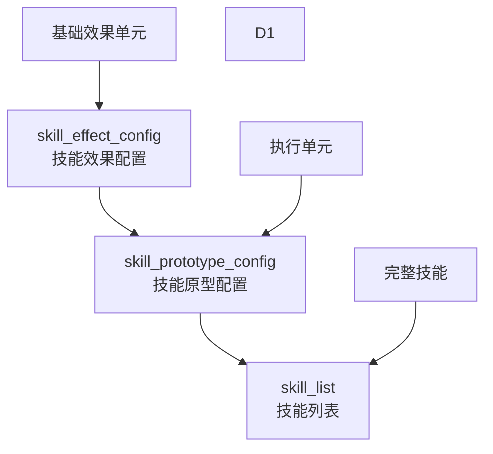

# 技能系统

这是一个基于三层架构设计的游戏技能系统，玩家和 NPC 的所有技能都通过数据表进行配置。

!!! info "数据表示说明"

    - `<>` 表示数据表
    - `{}` 表示数值或参数
    - `[]` 表示字段

## 系统架构

技能系统采用**效果 → 原型 → 技能**的三层架构：

```mermaid
graph TD
    A[skill_effect_config<br/>技能效果配置] --> B[skill_prototype_config<br/>技能原型配置]
    B --> C[skill_list<br/>技能列表]

    A1[基础效果单元] --> A
    B1[执行单元] --> B
    C1[完整技能] --> C
    D1
```
