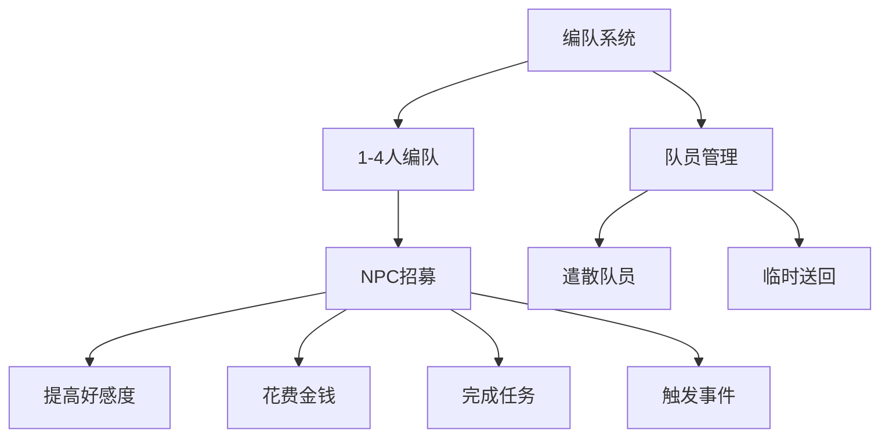

# 核心系统设计草案

!!! abstract "系统概述"

    核心系统围绕「装备」、「道具」、「掉落」机制构建，兼顾低成本、少美术需求的战斗系统设计。

## 🎮 参考游戏分析

| 参考游戏         | 评分                     | 系统特点                         | 推荐理由               |
| ---------------- | ------------------------ | -------------------------------- | ---------------------- |
| **艦これ**       | :star::star::star::star: | 编组系统 + 强化系统 + 视觉化战斗 | 较为推荐，表现力强     |
| **魔法之塔**     | :star::star::star:       | 简化战斗机制                     | 实现简单，但表现力较弱 |
| **三国志战略版** | :star::star::star:       | 热门验证玩法                     | 需考虑角色定位问题     |

!!! question "核心问题"

    玩家扮演的是指挥官还是勇者？是否需要战略地图界面？

## 🏗️ 系统架构设计

### 战斗系统

!!! info "设计理念"

    - **表现形式**：采用「艦これ」的战斗表现
    - **判定方式**：借鉴「三国志战略版」的战斗判定
    - **参考融合**：结合多款经典游戏的优秀机制

### 编队系统

!!! tip "编队特色"

    - 支持 1 ～ 4 人灵活编队
    - 多种 NPC 招募方式
    - 灵活的队员管理机制

### 养成系统

=== "等级养成"

    **经验获取途径：**

    - :material-school: **指定地点训练**
    - :material-book-open: **使用技能书**
    - :material-sword-cross: **击败敌人**
    - :material-clipboard-check: **完成任务**
    - :material-star-circle: **触发事件**

=== "技能养成"

    **技能配置：**

    - :material-shield-account: **初始技能**：每个 NPC 自带一个技能
    - :material-plus-circle: **学习空位**：额外两个技能空位可学习

    **技能获取方式：**

    - :material-book: 技能书学习
    - :material-map-marker: 特定地点领悟
    - :material-calendar-check: 任务奖励
    - :material-lightning-bolt: 事件触发

    **技能提升：**

    - :material-package-variant: 使用道具
    - :material-repeat: 使用频率积累

## 💰 经济系统

### 贸易系统

!!! note "价格机制"

    商品价格根据以下因素动态调整：

    - :material-clock-outline: **时间变化**：每日价格波动

    - :material-alert-circle: **事件影响**：特殊事件触发价格变动

### 掉落系统

!!! success "掉落特色"

    战斗结束后，玩家可指定搜索击败敌人的每一个包裹

## 👥 职业与技能体系

### 职业类型

| 职业                                | 特色     | 定位     |
| ----------------------------------- | -------- | -------- |
| :material-shield: **骑士**          | 防御专精 | 坦克     |
| :material-sword: **战士**           | 物理输出 | 近战 DPS |
| :material-cross: **祭司**           | 治疗支援 | 辅助     |
| :material-auto-fix: **法师**        | 魔法输出 | 远程 DPS |
| :material-bow-arrow: **游侠**       | 敏捷射击 | 远程物理 |
| :material-currency-usd: **商人**    | 贸易专精 | 特殊职业 |
| :material-music: **游吟诗人**       | 团队增益 | 辅助     |
| :material-rocket-launch: **穿越者** | 特殊能力 | 隐藏职业 |

### 技能分类

!!! info "技能类型系统"

    === "永久技能 (0)"
        持续生效的被动能力

    === "主动技能 (1)"
        需要手动释放的技能

    === "被动技能 (2)"
        自动触发的能力

    === "光环技能 (3)"
        影响范围内队友的技能

    === "触发技能 (4)"
        满足条件时自动发动

    === "职业技能 (5)"
        职业专属特殊技能

---

!!! example "系统融合参考"

    - **EVE Online** 的交易系统
    - **艦これ** + **三国志战略版** 的战斗系统
    - **逃离塔科夫** 的饮食与摸金系统
