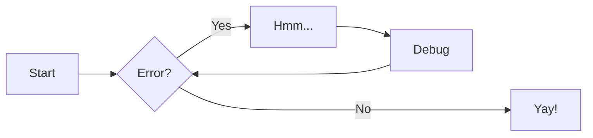

# 欢迎来到我的文档站点

这是一个基于 MkDocs 构建的文档网站，展示了 Material 主题的各种功能。

## 快速开始

!!! note "提示"

    这是一个提示框，用于显示重要信息。

!!! warning "警告"

    这是一个警告框，提醒用户注意事项。

!!! tip "小贴士"

    这是一个小贴士，分享有用的技巧。

## 文本格式

这是**粗体文本**，这是*斜体文本*，这是~~删除线文本~~。

这是`行内代码`，这是==高亮文本==。

> 这是一个引用块
>
> 可以包含多行内容

## 列表

### 无序列表

- 第一项
- 第二项
  - 子项目 1
  - 子项目 2
- 第三项

### 有序列表

1. 第一步
2. 第二步
3. 第三步

### 任务列表

- [x] 已完成的任务
- [ ] 待完成的任务
- [ ] 另一个待完成的任务

## 代码块

### Python 代码

```python
def hello_world():
    """
    这是一个简单的Python函数
    """
    print("Hello, World!")
    return "Hello from MkDocs!"

# 调用函数
hello_world()
```

### 建议框

??? question "标题文字"

    In order to minimize friction and maximize productivity, Material for MkDocs provides its own schema.json for `mkdocs.yml`. If your editor supports YAML schema validation, it's definitely recommended to set it up:

    === "Visual Studio Code"

        1. Install `vscode-yaml` for YAML language support.

        2. Add the schema under the `yaml.schemas` key in your user or workspace `settings.json`:

            ```json
            {
              "yaml.schemas": {
                "https://squidfunk.github.io/mkdocs-material/schema.json": "mkdocs.yml"
              },
              "yaml.customTags": [
                "!ENV scalar",
                "!ENV sequence",
                "!relative scalar",
                "tag:yaml.org,2002:python/name:material.extensions.emoji.to_svg",
                "tag:yaml.org,2002:python/name:material.extensions.emoji.twemoji",
                "tag:yaml.org,2002:python/name:pymdownx.superfences.fence_code_format",
                "tag:yaml.org,2002:python/object/apply:pymdownx.slugs.slugify mapping"
              ]
            }
            ```

    === "Other"

        其他编辑器的配置...

### 即时预览

[查看](id_list.md#常用-id){ data-preview }

### 注释

这里是注释, (1) 你点击可以查看？
{ .annotate }

1.  :man_raising_hand: 这里是注释 `代码`, **加粗文本**, 反正很多功能.

### 表格

|  Method  | Description                          |
| :------: | ------------------------------------ |
|  `GET`   | :material-check: Fetch resource      |
|  `PUT`   | :material-check-all: Update resource |
| `DELETE` | :material-close: Delete resource     |

### 流程图



### 提示

:material-information-outline:{ title="Important information" }

[Hover me](index.md "I'm a tooltip!")
